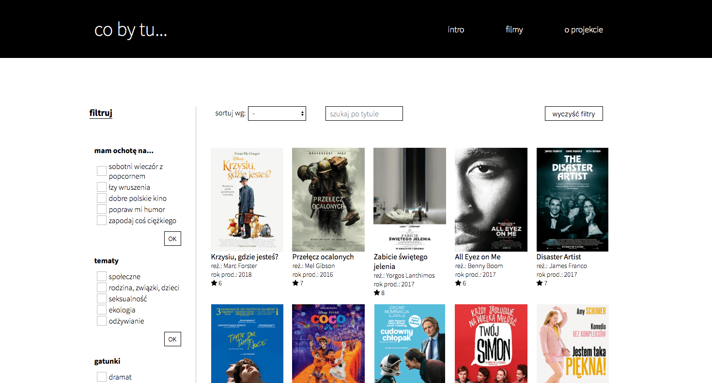
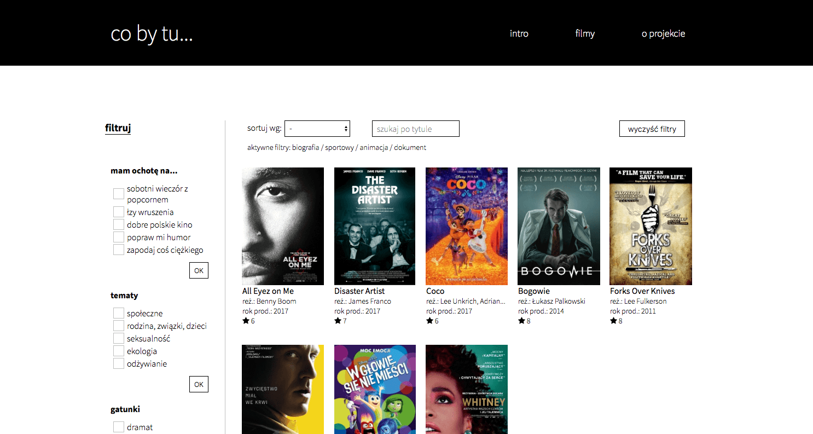
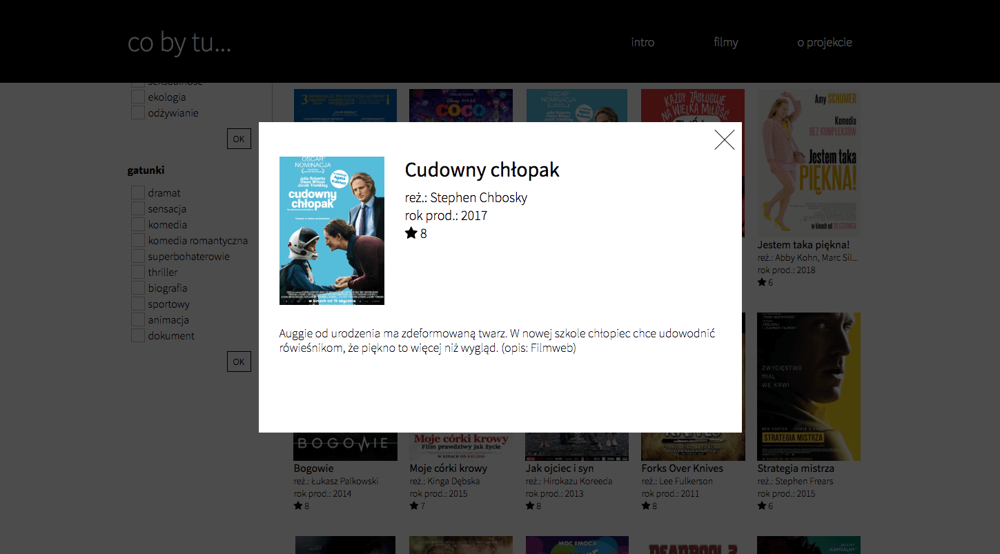
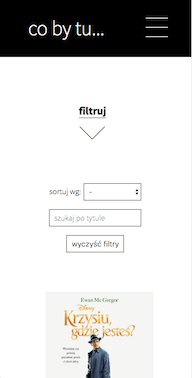
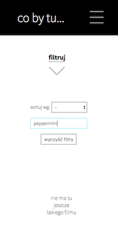

# Feeling like... watching a movie (Co by tu... obejrzeć)

Welcome to my very first website developed in React. It's a kind of a blog with a bunch of my film recomendations. My private [Filmweb](https://www.filmweb.pl/), as someone have said. Well... maybe some day :)

On the Intro page you are going to see also another section - Feeling like... reading a book (Co by tu... przeczytać). This is a plan for the further future. This section will be loaded with thrilling suggestions for bookworms (yeah, they still exist and are doing just fine).


## Getting Started

To run this project you will need to have **Node.js** and **Webpack** installed on your local machine. After forking and cloning the repo please run these commands in your command line:

```
npm install
```

and

```
npm start
```

The project will be running in your browser at http://localhost:8080/.


## Tools

- React
- Sass
- Webpack
- Google Firebase (Realtime Database)


## Design

The site is designed with RWD approach, desktop-first. In the mobile version I use a hamburger menu and hide the filters (but don't worry, you can still get to them by clicking the arrow down).


## Features

- On the main page (Films) you are going to see films being loaded from my database - their posters, titles, directors, year of production and my rate. 
- You can read a few words of a film's description by clicking on its card.
- On the left there are many custom filters. You can filter films according to your mood, a topic you want to study or more traditionally - according to a genre.
- Once you choose filters you are going to see not only the selected films (wow!) but also names of filters which are active at the moment.
- If you happen to choose a filter which doesn't match any film in my collection at a moment (try "social issues" or "ecology"), an adequate piece information will show up.
- In case you are fed up with filtering there is a "clear filters" button on the right.
- You can sort the films if you like, why not! Alphabetically, by rate or year of production (the last two in descending order). The default order is of ID number. While filters are changing the sorting order is being kept. If you want to clear sorting just change the select's value to default.
- Live search - type in a title you're interested in and check if it's in my database.
- If you happen somehow to get lost on my website by typing in a link which doesn't exist, you will see a "not found" page.

#### 

## Plans for the future

- Pagination
- The book part - of course


## Demo

### [Co by tu...](https://karin-on.github.io/co-by-tu/)


## Previews







   

